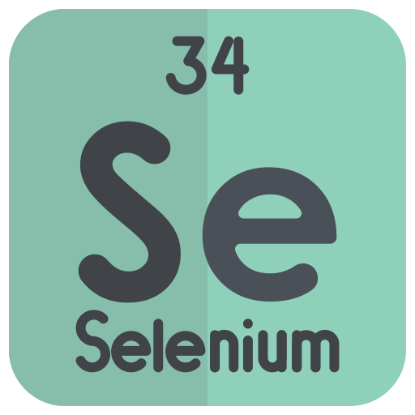
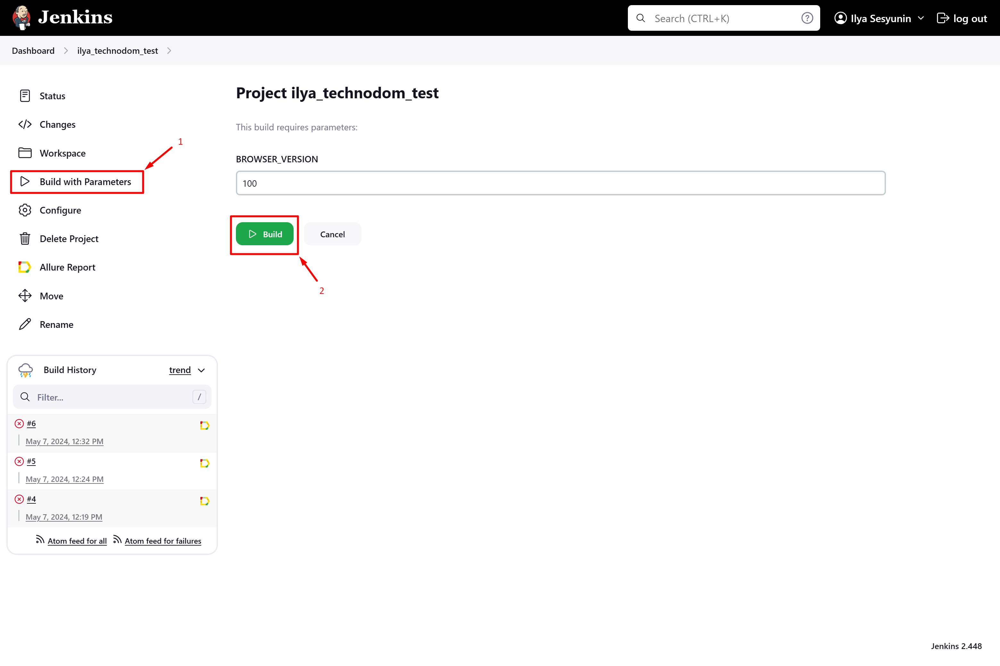
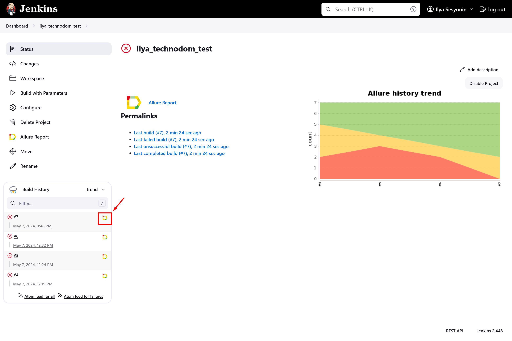
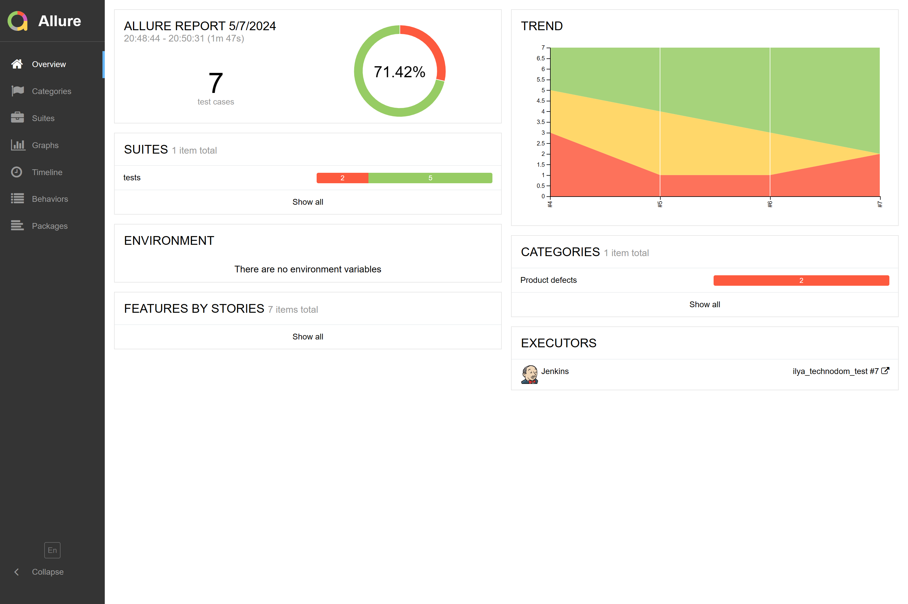
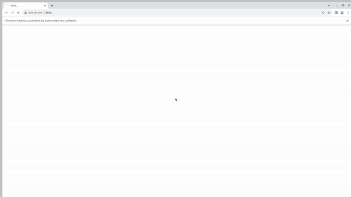
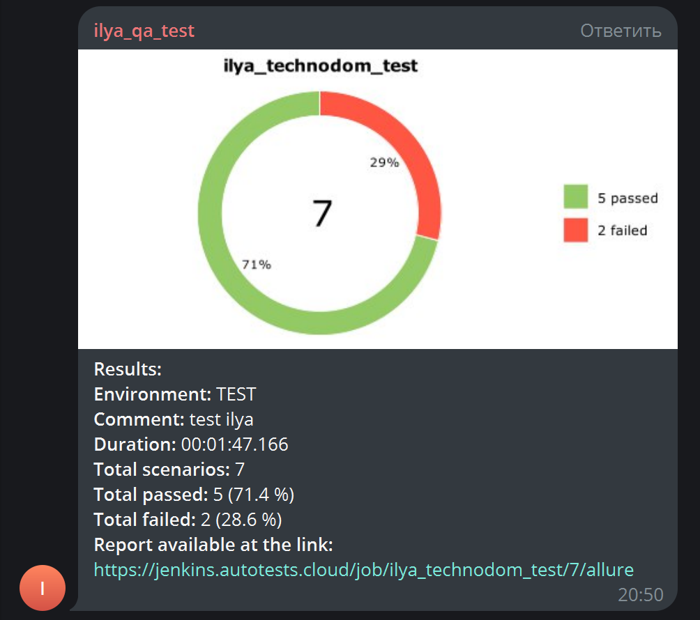

<h1>Autotesting of the online store <i>technodom.kz</i></h1>

    

<h2> 📖 Description</h2>
<li><a href="#tools">Tools</a></li>
<li><a href="#tests">Tests</a></li>
<li><a href="#run-tests">Run tests</a></li>
<li><a href="#test-example">Example of passing test</a></li>
<li><a href="#telegram-notification">Telegram notifications</a></li>

---

<h2 id="tools"> ⚙️ Tools</h2>

    
    
    
    
    
    
    
    
    
    

<li>
Autotests are written in the <b>Python</b> programming language and run in the <b>Selenide</b> virtual environment

<li>
Tests are run from <b>Jenkins</b>

<li>
<b>Selenoid</b> is used to launch the browser

<li>
<b>Allure report</b> is generated and sent notifications to the telegram chat

---

<h2 id="tests"> 🐞 Tests</h2>

<li><a> Change correct region</a>
<li><a> Change incorrect region</a>
<li><a> Searching products</a>
<li><a> Add to cart</a>
<li><a> Removing from cart</a>
<li><a> Add to favorites</a>
<li><a> Removing from favorites</a>

---

<h2 id="run-tests"> 🏃‍♂️ Run tests</h2>

<pre>
    python -m venv .venv
    source .venv/bin/activate
    pip install -r requirements.txt
    pytest . --browser_version=${BROWSER_VERSION}
</pre>

<b>Parameters</b>: 
    <li>BROWSER_VERSION - browser version in which the tests will be run</li>

---

To run tests in Jenkins you need to click on <b>Build with Parameters</b> button

Сhoose parameters (<i>BROWSER_VERSION</i>) and click on <b>"Build"</b> button

After passing the tests report will be generated, you can see it by clicking on the <b>Allure report</b>

---

<h2 id="test-example"> 🗒️ Example of passing search of company test</h2>

---

<h2 id="telegram-notification"> 🔔 Telegram notifications</h2>

